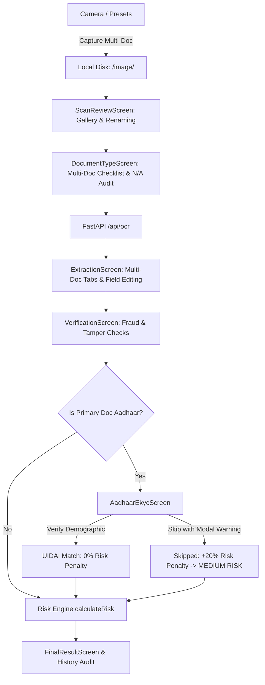

# SecureScan AI — Project Architecture & Backend Integration Guide

> **SecureScan AI** is an AI-powered identity document scanner, OCR parsing, forensic fraud detection, and multi-factor risk assessment system built with a camera-first smartphone UX.

---

## 📁 Repository Structure

```
SIH/
├── backend/                        # Python FastAPI Backend (CV, OCR, Image Processing)
│   ├── main.py                     # FastAPI application entrypoint & API routes
│   └── processor.py                # Computer Vision pipeline (Perspective warp, deskew, filters)
├── frontend/                       # Next.js 16 (React 19, TypeScript, Tailwind CSS)
│   ├── public/
│   │   └── samples/                # Preset sample documents (SVG / Mock images)
│   ├── src/
│   │   ├── app/
│   │   │   ├── api/
│   │   │   │   └── save-image/     # Next.js route: Saves captures directly to /image folder
│   │   │   │       └── route.ts
│   │   │   ├── layout.tsx          # App root layout
│   │   │   └── page.tsx            # Main application controller & state machine
│   │   ├── components/
│   │   │   ├── history/            # Scan audit history tab view
│   │   │   │   └── HistoryView.tsx
│   │   │   ├── scanner/            # Camera & document framing components
│   │   │   │   ├── ManualCropWrapper.tsx # 4-point corner drag adjustment wrapper
│   │   │   │   └── WebCamScanner.tsx     # Webcam viewfinder, laser sweep, multi-doc session
│   │   │   ├── settings/           # App settings & backend URL configuration
│   │   │   │   └── SettingsView.tsx
│   │   │   └── workflow/           # Verification pipeline screens
│   │   │       ├── AadhaarEkycScreen.tsx # eKYC verification & skip warning modal
│   │   │       ├── DocumentTypeScreen.tsx# Multi-doc checklist (Scanned vs N/A, custom filenames)
│   │   │       ├── ExtractionScreen.tsx  # Multi-doc tabbed OCR viewer & field editor
│   │   │       ├── FinalResultScreen.tsx # Risk score gauge, level (Low/Med/High), audit checks
│   │   │       ├── ScanReviewScreen.tsx  # Multi-doc gallery review, lightbox, rename inputs
│   │   │       └── VerificationScreen.tsx# Step-by-step security validation checklist
│   │   ├── services/
│   │   │   └── verificationService.ts # API client with realistic demo fallbacks & risk scoring
│   │   ├── types/
│   │   │   └── index.ts            # TypeScript interfaces (VerificationResult, ExtractedField, etc.)
│   │   └── utils/
│   │       └── scannerUtils.ts     # Client-side canvas transformations & fallbacks
│   ├── package.json
│   ├── tsconfig.json
│   └── next.config.ts
├── image/                          # Storage folder where all captured scans are saved to disk
├── package.json                    # Workspace root scripts
├── walkthrough.md                  # Features walkthrough & sprint summary
└── README.md                       # This document
```

---

## 🔄 End-to-End Workflow & Architecture



---

## 🔌 API Endpoints Specification

The frontend connects to the backend via `NEXT_PUBLIC_API_URL` (default: `http://localhost:8000`). If the Python backend is offline during prototyping, `verificationService.ts` seamlessly uses realistic fallbacks so the UI never breaks.

### 1. Computer Vision & Scanning Endpoints (Already in `backend/main.py`)

#### `POST /detect-corners`
Detects 4-point document corners for perspective correction.
- **Request**: `multipart/form-data` with `file: UploadFile`
- **Response**:
  ```json
  {
    "corners": [{"x": 120.5, "y": 85.0}, {"x": 840.0, "y": 92.3}, {"x": 825.1, "y": 510.4}, {"x": 115.0, "y": 495.2}],
    "confidence": 0.89,
    "image_width": 960,
    "image_height": 600
  }
  ```

#### `POST /scan-pro`
Performs perspective warp, auto-deskew, white border trim, and enhancement filters.
- **Request Form Data**:
  - `file`: `UploadFile` (binary image)
  - `corners`: `string` (JSON array of `[{x, y}]`)
  - `filter_mode`: `"balanced"` | `"color"` | `"text"`
  - `horizontal_tilt`: `float` (degrees, -45 to 45)
  - `vertical_tilt`: `float` (degrees, -45 to 45)
  - `auto_deskew_enabled`: `bool` (default: `true`)
- **Response**: Processed image `image/png` (binary stream).

#### `POST /generate-pdf`
Generates a standard portrait A4 PDF from an uploaded image list.
- **Request**: `multipart/form-data` with `files: List[UploadFile]`
- **Response**: `application/pdf` download attachment.

---

### 2. AI Verification & OCR Endpoints (To Merge / Implement in Backend)

These endpoints are currently mapped in [verificationService.ts](file:///c:/Users/MSI-1/Desktop/SIH/frontend/src/services/verificationService.ts). Your backend teammate can implement them in FastAPI as follows:

#### `POST /api/ocr`
Extracts structured key-value demographic fields from the cropped document.
- **Request**: `multipart/form-data`
  - `file`: `UploadFile` (or `image_url: string`)
  - `document_type`: `"aadhaar" | "driving_license" | "passport" | "visa"`
- **Response Format**:
  ```json
  {
    "fields": {
      "name": {
        "key": "name",
        "label": "Full Name",
        "value": "Rahul Sharma",
        "confidence": 99,
        "editable": true
      },
      "dateOfBirth": {
        "key": "dateOfBirth",
        "label": "Date of Birth",
        "value": "14/03/2003",
        "confidence": 97,
        "editable": true
      },
      "gender": {
        "key": "gender",
        "label": "Gender",
        "value": "Male",
        "confidence": 99,
        "editable": true
      },
      "documentNumber": {
        "key": "maskedAadhaar",
        "label": "Aadhaar Number",
        "value": "XXXX XXXX 7821",
        "confidence": 98,
        "editable": true
      }
    }
  }
  ```

#### `POST /api/validate-document`
Validates field integrity, checksums, MRZ strings, and expiration dates.
- **Request JSON**:
  ```json
  {
    "docType": "passport",
    "fields": { ... }
  }
  ```
- **Response Format**:
  ```json
  {
    "isValid": true,
    "mrzValid": true,
    "checksumValid": true,
    "expiryValid": true,
    "errors": []
  }
  ```

#### `POST /api/detect-tampering`
Detects photo substitution, font interpolation, boundary artifacts, and digital manipulation.
- **Request**: `multipart/form-data` with `file: UploadFile`
- **Response Format**:
  ```json
  {
    "tampered": false,
    "tamperConfidence": 4,
    "anomalies": []
  }
  ```
  *(If tampered: `"tampered": true`, `"tamperConfidence": 85`, `"anomalies": ["Edge artifact detected around portrait boundary"]`)*

#### `POST /api/verify-face`
Matches the document photo against reference / selfie biometrics and performs passive liveness.
- **Request**: `multipart/form-data` with `file: UploadFile`
- **Response Format**:
  ```json
  {
    "matched": true,
    "matchScore": 96,
    "livenessPassed": true
  }
  ```

---

### 3. Frontend Internal API Route

#### `POST /api/save-image` ([route.ts](file:///c:/Users/MSI-1/Desktop/SIH/frontend/src/app/api/save-image/route.ts))
- Automatically invoked when an image is captured or preset loaded.
- Saves base64 / SVG files directly into the workspace root `SIH/image/` folder.
- Format: `[customName_or_docType]_[side].[ext]` (e.g. `aadhaar_front.jpg`, `driving_license_back.jpg`).
- Allows the Python backend team to directly read captured files from disk:
  ```python
  import cv2
  img = cv2.imread("../image/aadhaar_front.jpg")
  ```

---

## ⚖️ Risk Scoring & eKYC Skip Logic

The risk engine is defined in [calculateRisk](file:///c:/Users/MSI-1/Desktop/SIH/frontend/src/services/verificationService.ts):

| Scenario | Risk Level | Score (0–100) | eKYC Audit Status |
|---|---|---|---|
| **Clean scan + eKYC Verified** | `LOW RISK` | `18 – 28` | ✓ Aadhaar eKYC verified (Demographic match) |
| **Clean scan + eKYC Skipped** | `MEDIUM RISK` | `42 – 50` | ⚠️ Aadhaar eKYC skipped (+20% risk factor penalty) |
| **Tampered / Face Mismatch** | `HIGH RISK` | `70 – 95` | ❌ Flagged for manual physical verification |
| **N/A Documents Logged** | Maintained | Base Score | ⚠️ Appended as audit notes (*"Document not produced"*) |

---

## 🚀 How to Run the Project

### 1. Run Python Backend
```bash
cd backend
python -m venv venv
venv\Scripts\activate          # Windows PowerShell: .\venv\Scripts\Activate.ps1
pip install fastapi uvicorn opencv-python numpy img2pdf pydantic
uvicorn main:app --reload --port 8000
```

### 2. Run Next.js Frontend
```bash
cd frontend
npm install
npm run dev
```
Open **`http://localhost:3000`** in your browser.

---

## 🤝 Guide for Backend Teammate Merging Code

1. **Keep CORS Enabled**:
   ```python
   app.add_middleware(
       CORSMiddleware,
       allow_origins=["*"],
       allow_credentials=True,
       allow_methods=["*"],
       allow_headers=["*"],
   )
   ```
2. **Read from Shared Image Folder**:
   The frontend automatically saves the captured documents to `SIH/image/`. You can either accept uploads via `UploadFile` or read directly from the `image/` directory.
3. **Response Contract**:
   When implementing `/api/ocr`, return the dictionary under the `"fields"` key matching the `ExtractedField` schema (`key`, `label`, `value`, `confidence`, `editable`).
4. **Environment Variables**:
   In `frontend/.env.local`, set:
   ```env
   NEXT_PUBLIC_API_URL=http://localhost:8000
   ```

---

## 🤖 Note for Future Code Agents

When maintaining or extending this codebase:
1. **Linear Workflow State Machine**:
   - The master state machine lives in [frontend/src/app/page.tsx](file:///c:/Users/MSI-1/Desktop/SIH/frontend/src/app/page.tsx) under the `step` state (`'scanner' | 'crop' | 'review' | 'doc-type' | 'extract' | 'verify' | 'ekyc' | 'result'`).
   - Do NOT break the multi-doc state variables: `sessionDocs`, `sessionChecklist`, `allDocFields`, and `unavailableDocs`.
2. **Multi-Document Session Architecture**:
   - `WebCamScanner.tsx` accumulates multiple document captures in a single session (`capturedDocs: CapturedDoc[]`).
   - `ScanReviewScreen.tsx` provides a 2-column gallery with lightbox preview and per-card inline filename editing.
   - `DocumentTypeScreen.tsx` serves as a multi-document checklist (Scanned, N/A, custom names).
   - `ExtractionScreen.tsx` uses colour-coded doc tabs at the top to switch between documents independently.
3. **Graceful Fallbacks**:
   - Always preserve the `try/catch` mock fallbacks in `verificationService.ts` and `scannerUtils.ts`. The UI should remain fully testable and responsive even if backend microservices are down.
4. **Styling & UI Integrity**:
   - Keep the camera-first mobile viewport aesthetic (`max-w-md mx-auto` smartphone card wrapper).
   - Use Tailwind CSS utility classes and `lucide-react` icons. Ensure buttons never nest inside `<button>` elements (use `<div>` with `role="button"` for outer cards if needed).
